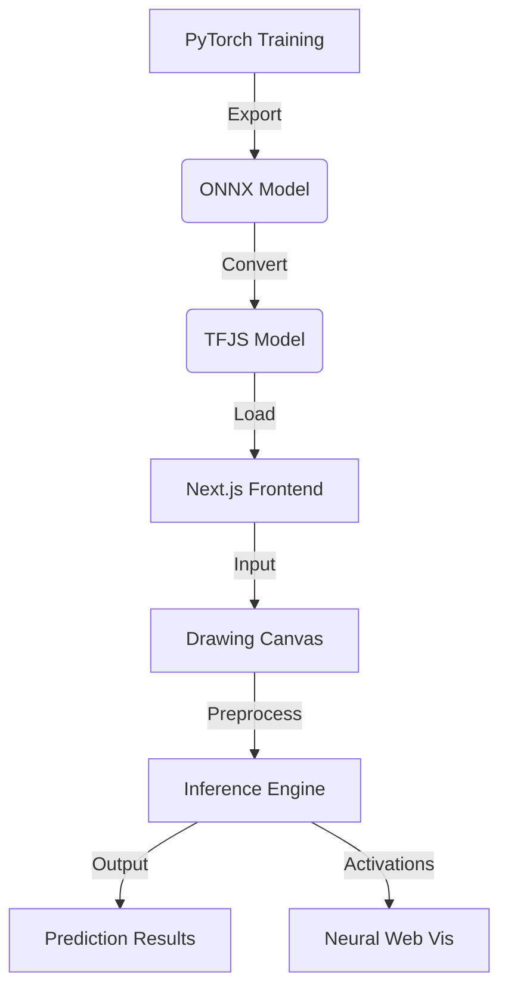

# NeuralDigit: MNIST Digits Recogniser

A modern, full-stack machine learning project featuring a high-accuracy CNN trained in PyTorch, exported to TensorFlow.js, and served via a premium Next.js web interface with real-time neural network visualization.


## Overview

This project demonstrates the end-to-end lifecycle of a machine learning application:
1.  **Training**: A Convolutional Neural Network (CNN) achieving **99.2%+ accuracy** on the MNIST dataset.
2.  **Export Pipeline**: Conversion from PyTorch (`.pt`) to ONNX and finally to TensorFlow.js for browser-based inference.
3.  **Web Interface**: A responsive Next.js application that allows users to draw digits and see real-time predictions.
4.  **Visualization**: A custom-built SVG engine that visualizes "neural flow" and activations across the network layers.

## Architecture



For more details, see [ARCHITECTURE.md](./ARCHITECTURE.md).

## Tech Stack

- **Machine Learning**: PyTorch, Torchvision, ONNX, TensorFlow.js
- **Frontend**: Next.js 15+, TypeScript, Tailwind CSS, Framer Motion
- **Icons & UI**: Lucide React, Custom SVG Components

## Project Structure

- `/training`: PyTorch training scripts and model export logic.
- `/web`: Next.js web application.
- `/data`: (Gitignored) MNIST dataset raw files.

## Quick Start

### Web Frontend
```bash
cd web
npm install
npm run dev
```

### Training (Optional)
```bash
cd training
pip install torch torchvision onnx tensorflowjs
python train.py
python export.py
```

## Detailed Documentation

- [**Architecture & Design**](./ARCHITECTURE.md) - Deep dive into the CNN and visualization logic.
- [**Training Guide**](./TRAINING.md) - Technical details on the model training process.
- [**Web Application**](./WEB_APP.md) - Details on the frontend implementation and TFJS integration.

---

